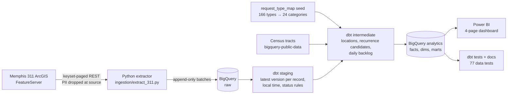

# Memphis 311 Service Reliability

An operational analytics platform that looks at Memphis 311 service requests in three ways: how quickly they
are closed, whether unresolved work is piling up, and whether problems **stay fixed** once they are closed.

> Closing a service request quickly is not the same as solving the problem reliably.

Most 311 dashboards stop at volume and time-to-close. This project adds two longitudinal measures:

* **Recurrence**: how often a related request comes back to the same place after the city closed the
  original, with a stated definition and a full sensitivity grid around it
* **Backlog dynamics**: the open backlog rebuilt day by day, split by age, so that growth in *old* work can be
  separated from swings in total volume

## Key findings

Data: 405,398 requests, October 2023 to September 2026. Full write-up: [`docs/findings.md`](docs/findings.md).

1. **Fast is not the same as durable.** Sewer backups close in half a day, but 21% return to the same address
   within 90 days. Cave-ins take three weeks and 9% return. Across categories, speed barely predicts
   durability (rank correlation −0.25).
2. **Missed collection drives repeat work.** It accounts for 58% of all 90-day recurrences and 73% of chronic
   locations. Without it, the city-wide recurrence rate drops from 22.1% to 15.7%.
3. **Old backlog grows no matter what the total does.** A one-day administrative closure of 24,632 aged
   requests (2025-09-22) cut the backlog by two thirds. Requests older than 180 days have grown by about 190
   a month since then, whether the total was falling or rising.
4. **Repeat activity is concentrated.** 4.4% of repeat locations (the "chronic" tier) account for 29% of
   recurrence cycles.
5. **Durability varies within the city.** Council districts differ by 5 points in recurrence, while Census
   tracts range from 13% to 36%.

## Architecture



| Layer | Dataset | Contents |
|---|---|---|
| Raw | `raw` | `memphis_311_requests` (append-only, one batch per run), `ingestion_batches` (run audit) |
| Staging | `staging` | `stg_311_requests`: latest version per record, deletions inferred from snapshots |
| Intermediate | `intermediate` | Location entities, recurrence originals and candidate pairs, daily open backlog |
| Analytics | `analytics` | `fact_service_requests`, `fact_request_recurrence`, 5 dimensions, 9 aggregate marts |

## Repository

```text
ingestion/extract_311.py      API → BigQuery raw (full or incremental)
dbt/                          staging → intermediate → analytics models, seed, tests, analyses
scripts/run_pipeline.py       extract + dbt build + docs + data dictionary in one command
scripts/                      data-dictionary generator, tract-shape export for Power BI
powerbi/                      DAX measures, theme, map shapes, build guide, validation SQL
docs/findings.md              key findings
docs/methodology.md           metric definitions, recurrence method, sensitivity, validation, limitations
docs/decisions.md             decision log (D01–D30) with evidence for every judgment call
docs/data_dictionary.md       generated column-level dictionary for every model
```

## Running it

Requirements: Python 3.12 with [uv](https://docs.astral.sh/uv/), and a Google Cloud service account that can
create datasets and run queries in a BigQuery project.

```bash
uv sync
export GOOGLE_APPLICATION_CREDENTIALS=/path/to/service-account.json   # PowerShell: $env:GOOGLE_APPLICATION_CREDENTIALS = "..."

uv run python scripts/run_pipeline.py --full          # first run, then weekly: full snapshot (detects deletions)
uv run python scripts/run_pipeline.py                 # daily: incremental extract (48 h lookback) + dbt build
uv run python scripts/run_pipeline.py --skip-extract  # rebuild models only
```

The dbt profile (`dbt/profiles.yml`) targets project `mem-311`. Change `project` there to use your own. A
full extraction takes about two minutes. `dbt build` (24 models, 1 seed, 77 tests) takes a few minutes.

The dashboard is assembled in Power BI Desktop from the `analytics` marts by following
[`powerbi/build_guide.md`](powerbi/build_guide.md). The guide lists expected values for every headline visual.
`powerbi/validation_queries.sql` reproduces them in SQL.

## Dashboard

| Page | Question | Main visuals |
|---|---|---|
| System Health | Is the system keeping pace with demand? | Opened vs closed, backlog trend, resolution trend, 90-day recurrence |
| Backlog Aging | Where is unresolved work accumulating? | Age-band stack over time, current backlog by category and age, share older than 90 days |
| Service Durability | Which services close quickly but come back? | Resolution vs recurrence by category, tract map, definition-sensitivity matrix |
| Persistent Locations | Where are chronic problems concentrated? | Location map and ranking, recurrence-cycle distribution, request history of the selected location |

The planned fifth page, on pothole detection, was dropped. AI-detected potholes are identifiable but make up
1.1% of pothole requests, too few for a before/after analysis
([D15](docs/decisions.md#d15--pothole-stretch-analysis-not-feasible-omitted)).

## Data quality and methodology highlights

* **Privacy.** Resident contact details, utility-customer fields, staff names and free-text narratives are
  dropped before anything is stored. Phone numbers and emails in the one retained text field are redacted.
* **Closure handling.** 4% of closed records have no close date. They leave the backlog at their last edit but
  are excluded from resolution times. A one-day mass closure of 24,632 aged requests is detected by rule and
  treated as an administrative exit, not a resolution.
* **Location matching.** Addresses are normalized to a house-number key. Coordinates are validated against
  the county boundary and cleared of geocoder default points and street-level geocodes. The recurrence
  definition matches property problems (e.g. missed pickups) on the address only, and public-space problems
  (e.g. potholes) on the address or within 25 m.
* **Right-censoring.** A closure only counts toward the 90-day rate once 90 days have passed.
* **Sensitivity.** The headline 22.1% rises to 52.6% if any same-category request within 100 m counts,
  and falls to 16.7% if only the identical request type at the same address counts. The full grid ships as a
  mart and a dashboard visual.
* **Validation.** 71 of 80 hand-reviewed recurrence pairs (89%) were the same problem at the same place.
  Reviewing the pairs also led to two matching fixes.
* **Tests.** Keys and relationships, plus tests that the backlog conserves flow, recurrences follow
  closures, sensitivity is monotonic, and the fact table reconciles to staging.

## Limitations

311 data records *reported* problems, and reporting varies by neighborhood, so volumes are never read as
need and no per-capita rates are shown. Recurrence is an operational proxy: a return report may be an unfixed
problem, a poor repair or a new incident. The source has no status history, so reopen cycles are invisible.
The current city system starts in October 2023, which limits seasonal comparisons. Details are in
[`docs/methodology.md#limitations`](docs/methodology.md#limitations).

## Stack

Python 3.12 (requests, google-cloud-bigquery, pandas) · BigQuery (incl. GIS functions) · dbt-core 1.12 with
dbt-bigquery and dbt_utils · Power BI (DAX, Shape Map with Census tract TopoJSON)

Source data: City of Memphis 311 request map service, read-only public endpoint.
