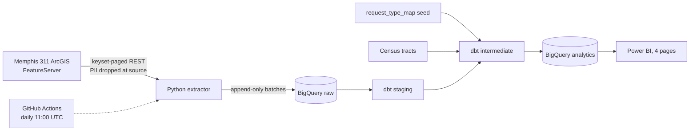

> Closing a service request quickly is not the same as solving the problem reliably.

Most 311 dashboards stop at volume and time-to-close. This project looks at Memphis 311 requests three ways:[^plan]

| Lens | Question | Start with |
|---|---|---|
| Responsiveness | How quickly are requests closed? | [Responsiveness](methodology/responsiveness.md) |
| Backlog dynamics | Is unresolved work piling up, and is the *old* part growing? | [Backlog reconstruction](methodology/backlog.md) |
| Durability | Do problems stay fixed once closed, and where do they keep coming back? | [Recurrence](methodology/recurrence.md), [Persistent locations](methodology/persistent-locations.md) |

What the data shows is in [findings](findings/index.md); every judgment call behind it is in
[decisions](decisions/index.md).

# Scope

* **Data**: every request in the City of Memphis 311 system ([source](sources/memphis-311-featureserver.md)),
  analysed from 2023-10-01, when the current system went live ([D09](decisions/D09-analysis-window-start.md)). The warehouse refreshes daily
  ([Scheduled refresh](playbooks/scheduled-refresh.md)); figures quoted in this bundle are from the extract of
  2026-09-23 unless stated otherwise.
* **Out of scope**: per-capita rates and any reading of volume as need (311 records *reported* problems),
  neighborhood geography (no defensible boundaries, [D18](decisions/D18-geography.md)), reopen cycles (no status history, [D25](decisions/D25-backlog-reconstruction.md)) and the
  pothole-detection analysis ([D15](decisions/D15-pothole-analysis-omitted.md)). See [Limitations](methodology/limitations.md).
* **Privacy**: resident contact details, staff names and free-text narratives are dropped before anything is
  stored ([D02](decisions/D02-drop-personal-fields-at-extraction.md), [D03](decisions/D03-redact-resolution-summary.md)).

# Architecture

| Layer | Dataset | Contents |
|---|---|---|
| Raw | [`raw`](tables/raw/index.md) | Append-only extraction batches and the ingestion audit |
| Reference | [`reference`](tables/reference/index.md) | The reviewed request-type classification seed |
| Staging | [`staging`](tables/staging/index.md) | Latest version of each record, deletions inferred from snapshots |
| Intermediate | [`intermediate`](tables/intermediate/index.md) | Location entities, recurrence originals and candidate pairs, daily open backlog |
| Analytics | [`analytics`](tables/analytics/index.md) | Facts, dimensions and aggregate marts read by Power BI |

Stack: Python 3.12 (uv), BigQuery with GIS functions, dbt-core 1.12 with dbt-bigquery and dbt_utils, Power BI.

# Deliverables

* The pipeline and models: [Run the pipeline](playbooks/run-the-pipeline.md).
* The four-page [dashboard](dashboard/index.md), assembled by hand from
  [the build guide](playbooks/build-the-power-bi-dashboard.md).
* Sanctioned SQL for every headline figure: [computations](computations/index.md).
* [Portfolio text](project/portfolio-text.md).

[^plan]: Revised project plan
